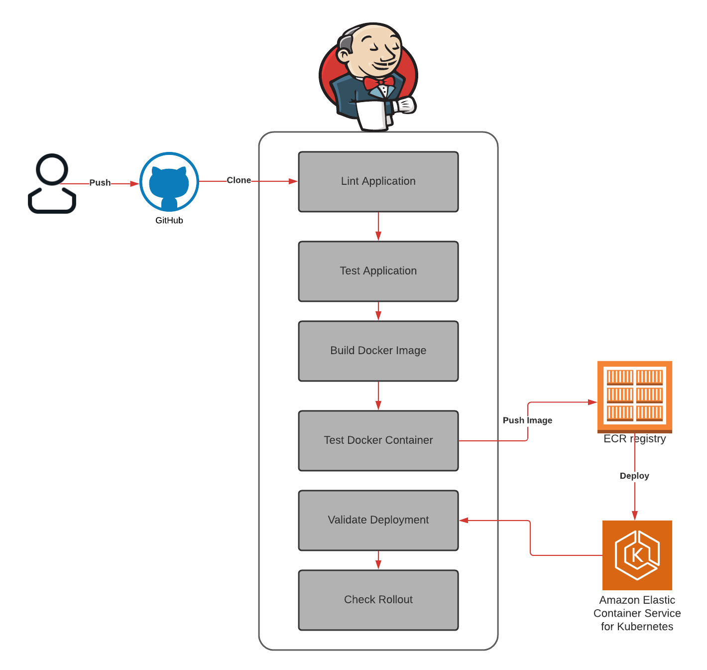

  

<h3 align="center">Udacity Cloud DevOps Nanodegree Capstone</h3>

---

 Deploy a high-availability site to AWS Kubernetes.
      

## 📝 Table of Contents

- [About](#about)
- [Project](#project)
- [Deployment](#deployment)
- [Usage](#usage)
- [Built Using](#built_using)
- [TODO](../TODO.md)
- [Contributing](../CONTRIBUTING.md)
- [Authors](#authors)
- [Acknowledgments](#acknowledgement)

## 🧐 About 

In this project I applied the skills and knowledge which were developed throughout the Cloud DevOps Nanodegree program. These include:

* Working in AWS
* Using Jenkins or Circle CI to implement Continuous Integration and Continuous Deployment
* Building pipelines
* Working with Ansible and CloudFormation to deploy clusters
* Building Kubernetes clusters
* Building Docker containers in pipelines

## 🏁 Project 
For this project I created a CI/CD pipeline for a basic containerized NodeJS application. I pushed docker image to ECR and then deployed the container in EKS cluster. 

## Project Steps

### Infrastructure
Using Cloudformation templates that are located under infrastructure folder. You will create the following stacks:
* Create Network infrastructure:
    * VPC
    * Two public subnets spread across two Availabilty Zones
    * Internet Gateway, with a default route on the public subnets.
* Create an AWS EC2 instance for Jenkins master server and another AWS EC2 instance for a Jenkins agent. 
* Create containers infrastructure:
    * ECR Registry
    * EKS Cluster
    * EKS Node Group
    

### Configuration

* Jenkins is pre-installed in Jenkins master instance and in Jenkins agent instance are these dependencies:
    *   Java Runtime Environment (JRE) & Java Development Kit (JDK)
    *   NodeJS & npm
    *   Hadolint
    *   Docker
    *   AWS CLI v2
    *   Kubectl
    *   jq

* After installing the Jenkins server, install these plugins:
    * Blue Ocean
    * Pipeline: AWS Steps
* Add credentials of Jenkins agent's SSH private keys, AWS, and GitHub token.

### Jenkins Pipeline
Build a declarative pipeline using Jenkins file. These are stages that are included in the pipeline:
* Lint Application and DockerFile using ESlint and Hadolint
* Test Application using Mocha
* Build Docker Image
* Test Docker Image with CURL command
* Push Image to ECR 
* Deploy to EKS
* Validate Deployment with CURL command
* Check Rollout

## Project structure
    ├──  infrastructure                 
    │   ├── containers
    |   |   ├── containers.yml
    |   |   ├── parameters.json
    |   |   ├── create.sh
    |   |   ├── update.sh
    │   ├── jenkins
    |   |   ├── instances.yml
    |   |   ├── parameters.json
    |   |   ├── create.sh
    |   |   ├── update.sh
    │   ├── network
    |   |   ├── network.yml
    |   |   ├── parameters.json
    |   |   ├── create.sh
    |   |   ├── update.sh
    ├──  kubernetes           
    │   ├── deployment.yml          
    │   ├── service.yml 
    ├──  images           
    │   ├── pipeline.png          
    │   ├── jenkins_pipeline.png
    ├──  test           
    │   ├── test.js   
    ├──  .eslintrc.yml 
    ├──  Dockerfile                
    ├──  Jenkinsfile                 
    ├──  server.js
    ├──  package-lock.json
    ├──  package.json
    

## 🎉 Acknowledgements 

- Udacity Team
- Inspiration
- References
